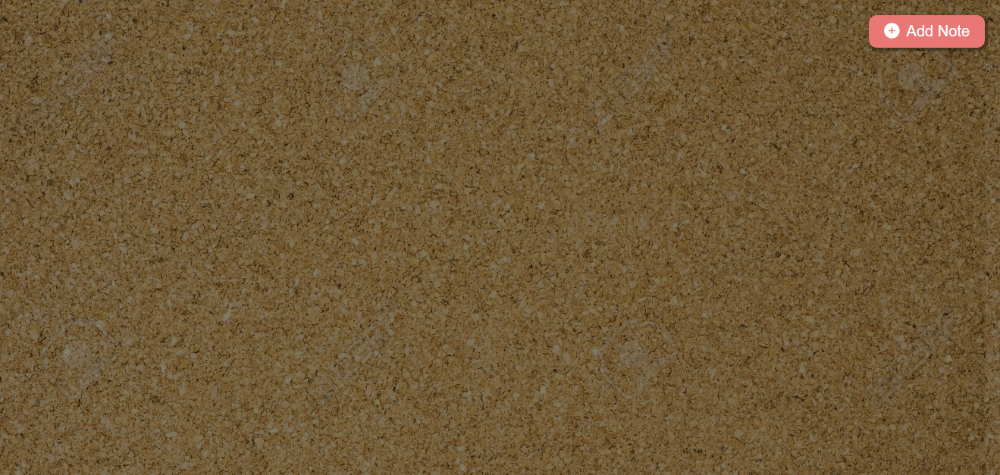
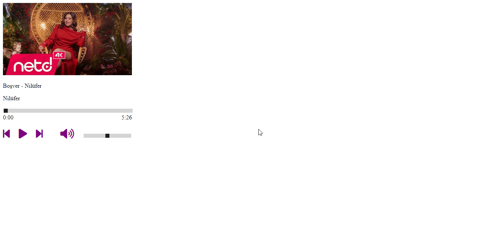
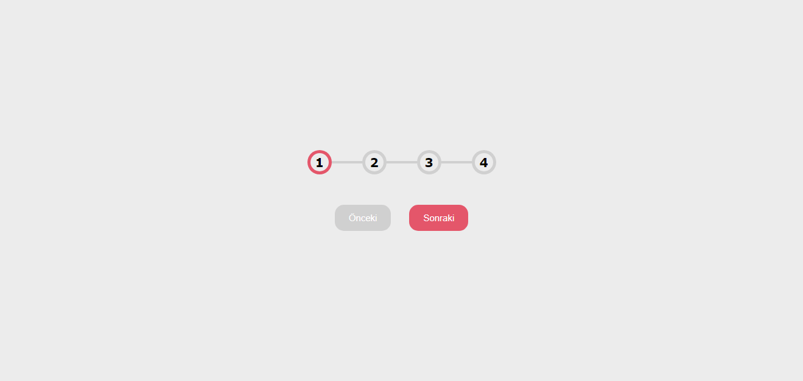

## Javascript Projects

> EN

This repository contains simple projects I made while improving myself in the JavaScript programming language. Ideas for these projects are abundant on the internet. So the ideas of these projects do not belong to me. I just wrote these ideas with my own codes. Therefore, the use of these projects is completely free. You can find the names, functions and photos of the projects in the articles below.

> TR

Bu repository, javascript yazılım dilinde kendimi geliştirirken yaptığım basit projeleri içerir. Bu projelerin fikirleri internette bolca bulunmaktadır. Yani bu projelerin fikri bana ait değildir. Sadece bu fikirleri kendi kodlarımla yazdım. Bu yüzden de bu projelerin kullanımı tamamen serbesttir. Projelerin isimlerini, işlevlerini ve fotoğraflarını, aşağıdaki yazılarda bulabilirsiniz.

## Projects

### [Auto Text](auto_text)

> [EN] It writes and deletes the texts you write in the "data" attribute in span tags for a certain period of time.

> [TR] Span etiketleri içerisine "data" niteliğine yazdığınız metinleri belirli bir süreliğine yazar ve siler.

---

### [Bottom Navbar](bottom_navbar)

> [EN] A bottom navbar project for mobile designs.

> [TR] Mobil tasarımlar için bir bottom navbar projesi.

---

### [Card Flip](card_flip)

> [EN] You can write two words you want, click on the cards to see and delete the other word.

> [TR] İstediğiniz iki kelimeyi yazabilir, kartların üzerine tıklayarak diğer kelimeyi görebilir ve silebilirsiniz.

---

### [Category Todolist](https://github.com/haktanoker/javascript_projects/tree/main/category%20todolist)

> [EN] You can add your tasks according to the category you want, mark them as completed and delete them.

> [TR] Görevlerinizi istediğiniz kategoriye göre ekleyebilir, tamamlandı olarak işaretleyebilir ve silebilirsiniz.

---

### [Cork Board](cork_board)

> [EN] In this project, notes can be added, edited and deleted on the corkboard. Also, since they are saved locally, they come back when the page is reopened.

> [TR] Bu projede notlar mantar panoya eklenebiliyor, düzenlenebiliyor ve silinebiliyor. Ayrıca yerele kaydedildikleri için sayfa yeniden açıldığında geri geliyorlar.

---

### [Counter](counter)

> [EN] A counter is created equal to the target number you write in "data-target".

> [TR] "data-target" içerisine yazdığınız hedef sayı kadar bir sayaç oluşturulur.

---

### [Dad Joke Generator](dad_joke_generator)

> [EN] Thanks to the API taken from the Internet, it shows various cold jokes on the screen.

> [TR] İnternetten alınan API sayesinde ekranda çeşitli soğuk şakalar gösterir.

---

### [Dark Mode](dark_mode)

> [EN] Thanks to the API taken from the Internet, it shows various cold jokes on the screen.

> [TR] İnternetten alınan API sayesinde ekranda çeşitli soğuk şakalar gösterir.

---

### [Dice Game](dice_game)

> [EN] After the players' names are written, the dice are rolled by pressing the button and the winner is determined.

> [TR] Oyuncuların isimleri yazıldıktan sonra butona basarak zarlar atılır ve kazanan belirlenir.

---

### [Drag & Drop](drag_drop)

> [EN] A simple drag and drop project.

> [TR] Basit bir sürükle ve bırak projesi.

---

### [FAQ Panel](faq_panel)

> [EN] A handy drop-down menu for frequently asked questions.

> [TR] Sıkça sorulan sorular için kullanışlı bir açılır menü.

---

### [Feedback](feedback)

> [EN] When hovering over the hearts, they are colored red. When you click on it, a selection is made.

> [TR] Kalplerin üzerine gelindiğinde kırmızıya boyanır. Üzerine tıklandığında ise seçim yapılır.

---

### [Github Profile](github_profile)

> [EN] A project that instantly retrieves the information in your Github profile.

> [TR] Github profilinizdeki bilgileri anlık olarak getiren bir proje.

---

### [Guess Number](guess_number)

> [EN] You have 10 guesses to find a random number generated by the system between 1-100.

> [TR] Sistem tarafından 1-100 arasında üretilen rastgele bir sayıyı bulmak için 10 tahmin hakkınız var.

---

### [Input Animation](input_animation)

> [EN] An animation that causes the letters of the label to fluctuate sequentially when the box is clicked.

> [TR] Kutuya tıklandığı zaman etiketin harflerinin sıralı şekilde dalgalanmasını sağlayan bir animasyon.

---

### [Key Press Info](key_press_info)

> [EN] A project that shows the information of the pressed key

> [TR] Basılan tuşun bilgilerini gösteren bir proje

---

### [Loading Screen](loading_screen)

> [EN] As the counter in the middle approaches 100 when the page loads, the blurriness of the page decreases.

> [TR] Sayfa yüklendiğinde ortadaki sayaç 100'e yaklaştıkça, sayfanın bulanıklığı azalır.

---

### [Menu Animation](menu_animation)

> [EN] When the button is pressed, the page turns and menus appear.

> [TR] Butona basıldığında sayfa döner ve menüler görünür.

---

### [Mouse Over Color](mouse_over_color)

> [EN] Whichever box the cursor hovers over, a random color lights up in that box and turns off after a while.

> [TR] İmleç hangi kutunun üzerine gelirse o kutuda rastgele bir renk yanar ve bir süre sonra söner.

---

### [Movie App](movie_app)

> [EN] A site that displays movie posters, titles, scores and descriptions using API.

> [TR] API kullanarak film afişlerini, isimlerini, puanlarını ve açıklamalarını gösteren bir site.

---

### [Music Player](music_player)

> [EN] It is a simple music player where we can turn the volume up and down, allowing us to skip to the next and previous song.

> [TR] Bir sonraki ve bir önceki şarkıya geçmemizi sağlayan, sesi açıp kapatabildiğimiz basit bir müzik çalar.

---

### [Navbar Animation](navbar_animation)

> [EN] When the button is pressed, the menus appear animatedly on the screen and the button turns into an X sign.

> [TR] Butona basıldığında menüler animasyonlu şekilde ekranda görünür ve buton X işaretine döner.

---

### [Password Strength](pass_strength)

> [EN] A password control system that checks the accuracy and reliability of the entered password according to certain criteria.

> [TR] Girilen şifrenin doğruluğunu ve güvenilirliğini belirli kriterlere göre kontrol eden bir şifre kontrol sistemi.

---

### [Pokemon](pokemon)

> [EN] A project that contains some information about 151 Pokemon, has a search box and gets this information from the API.

> [TR] 151 adet Pokemon'un bazı bilgilerini içeren, arama kutucuğu olan ve bu bilgileri API'dan alan bir proje.

---

### [Progress Steps](progress_steps)

> [EN] A project that increases and decreases a progression consisting of 4 stages by pressing buttons.

> [TR] 4 aşamadan oluşan bir ilerleyişi butonlara basarak artıran ve azaltan bir proje.

---

### [Quiz App](quiz_app)

> [EN] A classic quiz application consisting of four options and showing the score at the end.

> [TR] Dört adet seçenekten oluşan ve en sonda skorunu gösteren klasik bir quiz uygulaması.

---

### [Random Tag Picker](random_tag_picker)

> [EN] The system that makes a random selection among the written tasks.

> [TR] Yazılan görevler arasında rastgele bir seçim yapan sistem.

---

### [Reference Cards](reference_cards)

> [EN] A project that switches to a new person every 5 seconds and shows how much time is left to switch to the new person, thanks to the progress bar.

> [TR] 5 saniyede bir yeni kişiye geçen, ilerleme çubuğu sayesinde, yeni kişiye geçmeye ne kadar kaldığını gösteren bir proje.

---

### [Ripple Effect](ripple_effect)

> [EN] Animation of a growing white circle starting from where the button is clicked.

> [TR] Butona tıklanılan yerden başlayarak büyüyen bir beyaz bir daire animasyonu.

---

### [Scroll Animation](scroll_animation)

> [EN] As you scroll down the page, the elements in their order appear animated.

> [TR] Sayfayı aşağı kaydırdıkça sırası gelen elemanlar animasyonlu şekilde görünür.

---

### [Stopwatch](stopwatch)

> [EN] A simple stopwatch with start, stop and reset features.

> [TR] Başlatma, durdurma ve sıfırlama özellikleri olan basit bir kronometre.

---

### [Toast Notification](toast_notification)

> [EN] Sends a toast notification that disappears after 3 seconds.

> [TR] 3 saniye sonra kaybolan bir toast bildirimi gönderir.

---

### [Verify Account](verify_account)

> [EN] A code validator where we can only write numbers, but not characters like ", e + -".

> [TR] Sadece sayı yazabildiğimiz, ", e + -" gibi karakterleri yazamadığımız bir kod doğrulayıcı.

---

### [Weather App](weather_app)

> [EN] A weather project created by taking API data.

> [TR] API verisi alınarak yapılmış bir hava durumu projesi.
